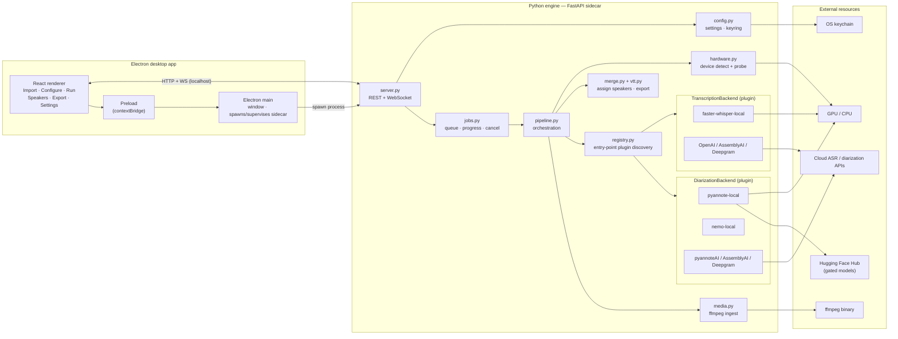
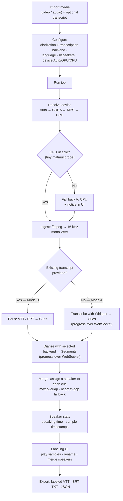

# diariza — architecture

## System component diagram

## How it works (process flow)

> Component status: the Python engine (orchestration, plugin registry, hardware probe, media,
> merge/export, pyannote-local + faster-whisper-local, CLI) is implemented (M1). The FastAPI server
> (M2), Electron shell (M3), labeling UI (M4), extra backends (M5), and installers (M6) are planned.
